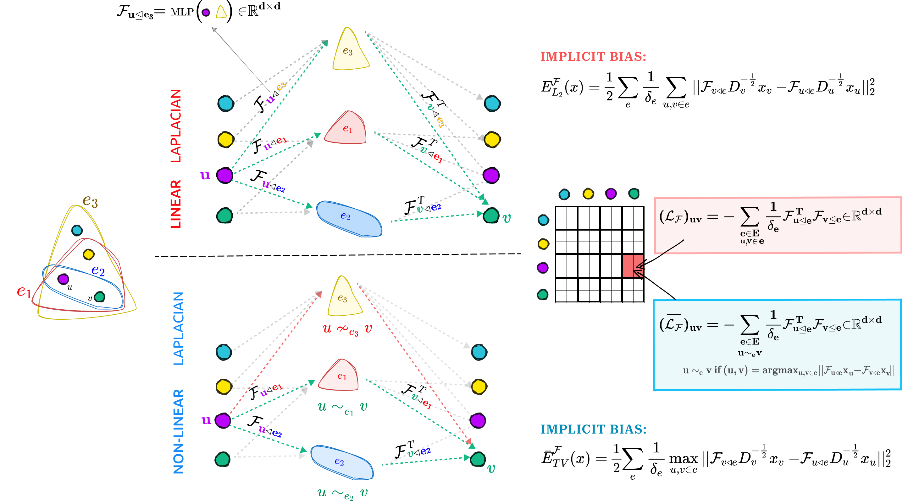
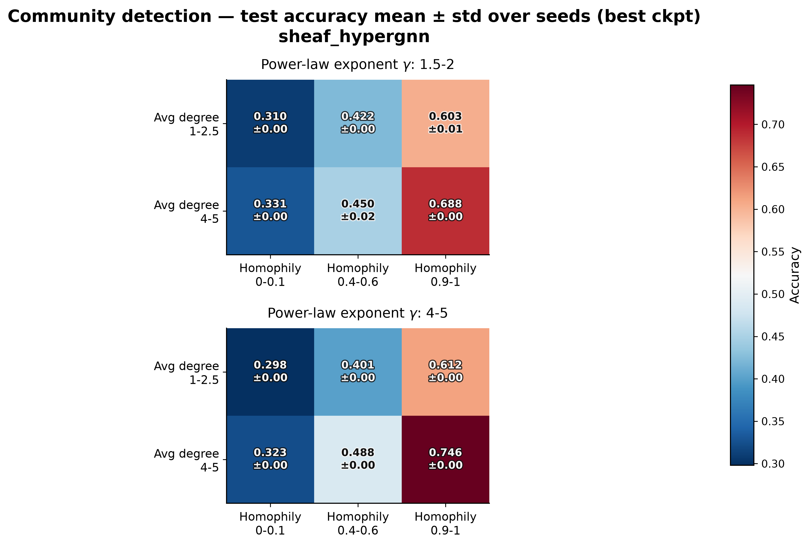
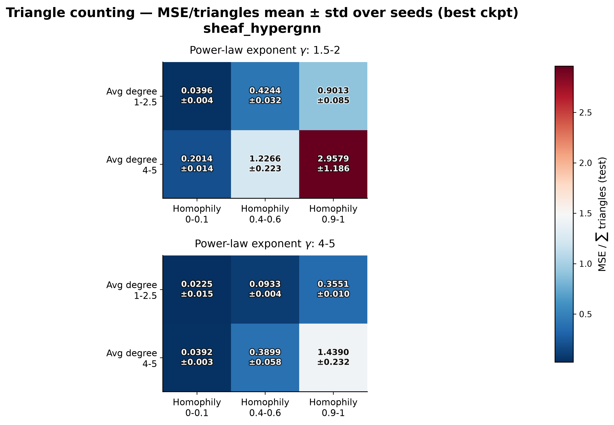

# Track 2 — SheafHyperGNN Submission

## Track

Track 2 — Topological Neural Networks (TNNs)

## Team Name

s/pairwise/ho

## Model

Sheaf Hypergraph Networks (SheafHyperGNN)

## Status

Ready for review

## Summary

This PR adds a TopoBench-native implementation of SheafHyperGNN (linear,
diagonal variant) from Duta et al., "Sheaf Hypergraph Networks" (NeurIPS 2023),
for the 2026 TDL Challenge.

**The main idea:** the paper extends a hypergraph so that each node–hyperedge
connection describes not only whether a node and hyperedge are connected, but
also how information should pass between them. This additional structure is
called a cellular sheaf. The model assigns every node and hyperedge its own
`d`-dimensional vector space, called a stalk, in which its local information is
represented. For each existing node–hyperedge connection, a learned `d × d`
restriction map transforms the node's local feature vector into the
representation received by the hyperedge, where it can be combined with
representations from the other incident nodes. Thus, while an ordinary 0/1
incidence entry only records that the connection exists, the restriction map
also specifies how information is transferred across it. Together, these maps
define the sheaf Laplacian, which replaces the hypergraph Laplacian in
the model's diffusion step.

*Source: Figure 1 in Duta et al.,
["Sheaf Hypergraph Networks"](https://proceedings.neurips.cc/paper_files/paper/2023/file/27f243af2887d7f248f518d9b967a882-Paper-Conference.pdf),
NeurIPS 2023.*

Ordinary message-passing diffusion repeatedly aggregates information across
connected nodes, often through averaging or normalized summation. Across many
layers, this can make node representations increasingly similar and lead to
over-smoothing. Sheaf diffusion first transforms information according to each
node–hyperedge connection, so different feature components can be scaled or
change sign before they are aggregated. This more selective diffusion can
preserve meaningful differences between node representations and thereby
mitigate over-smoothing.

The model uses node features and the incidence matrix as input. It initializes
each hyperedge feature by averaging the features of its connected nodes, then
uses the node and hyperedge features to predict the restriction maps. During
diffusion (message-passing), the sheaf Laplacian combines the transformed information
within each hyperedge and uses it to update the node representations. After the final
diffusion layer, TopoBench's readout converts the updated node embeddings into
task predictions.

The submitted implementation intentionally supports only the diagonal
restriction-map variant of `SheafHyperGNN`. The linear `SheafHyperGNN`
architecture was selected because it outperformed the nonlinear
`SheafHyperGCN` on all eight real-world datasets evaluated in the paper. Within
`SheafHyperGNN`, the paper's ablation study found that diagonal maps achieved
better accuracy on most tested datasets and provided a better balance between
complexity and expressivity than low-rank and general maps. The orthogonal,
low-rank, and general restriction-map variants, as well as the nonlinear
`SheafHyperGCN` architecture, are outside the scope of this PR.

Key hyperparameters for the submitted implementation (matching the reference
diagonal `SheafHyperGNN` example):

- diagonal restriction maps, stalk dimension `d=6`
- two diffusion layers with input normalization
- `tanh` activation on the restriction maps
- symmetric degree normalization
- `cp_decomp` restriction-map predictor
- averaged hyperedge initialization, retained for consistency with the
  reference configuration but not used by the selected `cp_decomp` predictor
- configured hidden width `256`, dropout `0.7`
- static restriction maps, with sheaf-map dropout, left projection, residual
  connections, and the special head disabled

The official challenge evaluator overrides every compatible feature encoder to
width `64`; because this model derives its hidden width from the encoder, the
reported GraphUniverse runs use hidden width `64`.

## Adaptations from the reference implementation

The main goals for this adaptation were readability and ease of verification.
The backbone implements the same diagonal restriction-map builder and linear
sheaf diffusion as the official repository, with changes required by
TopoBench's modular and batched execution:

- The original model receives all graph information inside a PyG `Data`
  object. In TopoBench, the wrapper instead passes the node features (`x_0`)
  and node–hyperedge incidence matrix (`incidence_hyperedges`) to the backbone
  as separate arguments.
- The original implementation trains on one fixed hypergraph, so it computes
  and stores the hyperedge features once. TopoBench can process different
  mini-batches, so our implementation recomputes the hyperedge features during
  every forward pass to ensure they correspond to the current batch.
- The total number of hyperedges is taken from the number of columns in the
  incidence matrix. This ensures that isolated hyperedges are still counted,
  even though they have no node connections and therefore do not appear in the
  list of nonzero incidences.
- In the original implementation, the final `lin2` layer converts the learned
  node embeddings into predictions. In TopoBench, the predictions are made by
  the readout, so the backbone returns the node embeddings.
- The wrapper residual is disabled because the reference configuration uses
  `residual_HCHA=False`.
- The implementation uses ELU between layers to follow the official code. The
  paper presents ReLU as the generic activation in Section 3.3; this
  paper/code discrepancy is not introduced by this implementation.

## Implementation Checklist

- [x] Inspect official implementation and paper equations; confirm feasibility.
- [x] Add SheafHyperGNN backbone under `topobench/nn/backbones/hypergraph/sheaf_hypergnn.py`.
- [x] Add Hydra config under `configs/model/hypergraph/sheaf_hypergnn.yaml`.
- [x] Add unit tests.
- [x] Add dense-reference-vs-sparse-diffusion sanity test.
- [x] Update `test/pipeline/test_pipeline.py`.
- [x] Run TopoBench pipeline smoke test with `graph/MUTAG`.
- [x] Run the official GraphUniverse evaluation notebook and add the generated
  `results.json`.
- [x] Re-run the final implementation on the cluster to record parameter-count
  and epoch-time fields in the notebook-generated results.

## Validation

- `python -m pytest test/pipeline/test_pipeline.py -q`
- Official `run_evaluation.ipynb`: all 72 runs completed successfully on one
  NVIDIA A40 (24 task/setting combinations over three seeds) and generated
  [`results.json`](results.json).

## Results

The official evaluation completed 36 community-detection and 36
triangle-counting runs over seeds `42`, `43`, and `44`. Across all structural
settings and seeds, mean in-distribution community-detection accuracy was
`0.4728`; mean triangle-counting MSE normalized by the number of structural
triangles was `0.6742`. Previous runs produced very similar results.

### Test results across GraphUniverse structural settings

Each cell below shows the mean and standard deviation over seeds `42`, `43`,
and `44`.

Community-detection accuracy increases consistently with homophily. The
highest mean accuracy occurs for high homophily, high average degree, and the
larger power-law exponent range. Although the restriction maps can adapt
messages from mixed hyperedges, these runs benefit most when the lifted
neighborhoods provide strong within-community connectivity. The exponent has
little overall effect on accuracy (`0.468` versus `0.478` when averaged over
the other settings), and the small seed deviations indicate stable results.

Lower values are better for triangle counting. The model performs best in the
larger power-law exponent range and is most challenged by high-homophily,
high-degree graphs in the smaller exponent range, whose heavy-tailed
structure creates more variable triangle counts. The 1-hop hypergraph lifting
does not encode triangles explicitly as 2-simplices, so the model must infer
them from overlapping incidence patterns. Seed variation is also largest in
the hardest setting.

### Empirical runtime

The final 72-run evaluation was executed on one NVIDIA A40 with PyTorch `2.3.0+cu121`.
The timer excludes the first 10 training epochs of each run as warm-up.
Values below summarize the per-run mean epoch times:

| Task | Runs | Mean ± SD across runs | Range | Timed epochs |
| --- | ---: | ---: | ---: | ---: |
| Community detection | 36 | 3.090 ± 0.298 s | 2.478–3.675 s | 1,895 |
| Triangle counting | 36 | 2.590 ± 0.281 s | 2.289–3.237 s | 380 |
| **All runs** | **72** | **2.840 ± 0.383 s** | **2.289–3.675 s** | **2,275** |

The complete notebook pipeline, including training, evaluation, OOD testing,
artifact generation, and orchestration overhead, took 9,789 seconds
(2 hours, 43 minutes, 9 seconds).

## Reference

Duta, I., Cassarà, G., Silvestri, F., & Liò, P.
"Sheaf Hypergraph Networks." *NeurIPS 2023.*

Paper: https://arxiv.org/abs/2309.17116

Official implementation: https://github.com/IuliaDuta/sheaf_HNN
