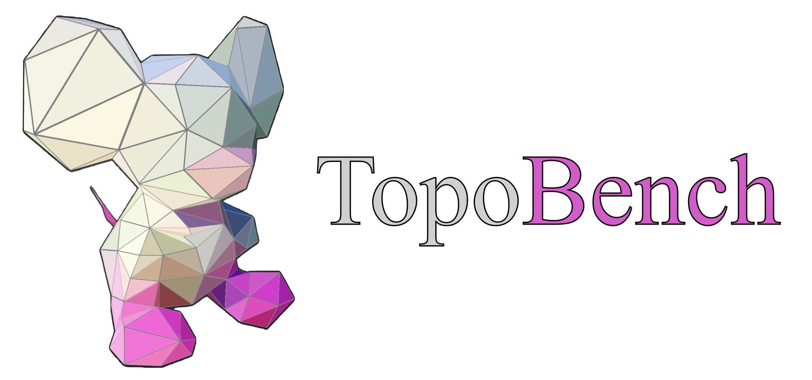

<h2 align="center">
  
</h2>

<h3 align="center">A reproducible benchmark core for graph, heterogeneous graph, and hypergraph learning</h3>

<p align="center">
  <a href="https://github.com/geometric-intelligence/TopoBench/actions/workflows/lint.yml"></a>
  <a href="https://github.com/geometric-intelligence/TopoBench/actions/workflows/test.yml"></a>
  <a href="https://app.codecov.io/gh/geometric-intelligence/TopoBench"></a>
  <a href="https://geometric-intelligence.github.io/topobench/index.html"></a>
  <a href="https://www.python.org/"></a>
  <a href="LICENSE"></a>
</p>

## What TopoBench supports

TopoBench composes a dataset, model, data pipeline, trainer, evaluator, and logger from Hydra configuration. Its current product surface has three domains:

- **Graph:** native PyTorch Geometric `Data` objects for inductive graph classification and regression, plus transductive node classification.
- **Heterogeneous graph:** native PyG `HeteroData` for single-graph node classification with full-graph or neighbor-sampled execution.
- **Hypergraph:** native `HypergraphData` for transductive node classification with EDGNN or PyG HypergraphConv.

Start with the [graph data guide](docs/graph_data.md), [heterogeneous graph guide](docs/heterogeneous_graphs.md), or [hypergraph guide](docs/hypergraphs.md). The [TopoBench paper](https://openreview.net/forum?id=07sTzyEVtY) gives the broader research context.

## Install with uv

TopoBench requires Python 3.11 and uses [uv](https://docs.astral.sh/uv/) for its environment.

```bash
git clone https://github.com/geometric-intelligence/topobench.git
cd topobench
source uv_env_setup.sh cpu
```

Pass `cu118` or `cu121` instead of `cpu` when that build matches the machine. The setup script creates `.venv`, selects the matching PyTorch and PyG packages, and synchronizes the project. For an existing compatible environment, install every project extra directly:

```bash
uv sync --all-extras
```

## Run the smallest graph experiment

The default selectors are `graph/SyntheticGraph` and `graph/gcn`. State them explicitly when checking configuration or comparing runs:

```bash
uv run python -m topobench dataset=graph/SyntheticGraph model=graph/gcn
```

A fixed graph-regression experiment is also available:

```bash
uv run python -m topobench experiment=graph_synthetic_regression
```

See [Graph data and batching](docs/graph_data.md) for split, target-shape, and edge-policy contracts.

## Run heterogeneous graph experiments

The offline synthetic dataset is the fastest way to compare the two loader modes. These commands use HGT; the detailed guide includes HeteroSAGE and every retained real-data selector.

Full-graph execution:

```bash
uv run python -m topobench experiment=heterogeneous_synthetic_hgt_full
```

Neighbor-sampled execution:

```bash
uv run python -m topobench experiment=heterogeneous_synthetic_hgt_neighbor
```

DBLP and OGB-MAG may require downloads and additional sampling packages. Read [Native heterogeneous graphs](docs/heterogeneous_graphs.md) before running them.

## Run hypergraph experiments

Both retained hypergraph models use the same deterministic node-classification fixture:

```bash
uv run python -m topobench experiment=hypergraph_synthetic_edgnn
uv run python -m topobench experiment=hypergraph_synthetic_hypergraph_conv
```

The [hypergraph guide](docs/hypergraphs.md) defines the incidence orientation, mask requirements, batching offsets, and processed-cache version.

## Understand batching by domain

The domains share a trainer but deliberately keep their native PyG representations.

| Domain | Runtime object | Batching contract |
| --- | --- | --- |
| Graph | `Data` / PyG `Batch` | `x` holds node features, `edge_index` holds graph connectivity, and PyG creates `batch` to map each concatenated node to its example while offsetting node indices. |
| Heterogeneous graph | `HeteroData` | Full mode reuses one typed graph and supervises the target store through its phase mask. `NeighborLoader` mode puts target seed nodes first and records their count in `batch[target_node_type].batch_size`; only those seeds contribute to loss and metrics. |
| Hypergraph | `HypergraphData` | `hyperedge_index[0]` stores node IDs and row 1 stores contiguous hyperedge IDs. PyG offsets the rows independently by the preceding examples' node and hyperedge counts. |

These rules are data contracts, not conversion conventions. Dataset loaders must return the native object for their domain.

## Read best-checkpoint metrics

Training emits ordinary phase metrics while the selected checkpoint is based on the callback's monitored validation metric. After training, TopoBench reloads that checkpoint and evaluates it again on validation and test data. The rerun values use distinct namespaces:

- `val_best_rerun/<metric>` for the validation rerun;
- `test_best_rerun/<metric>` for the test rerun.

For example, classification can produce `val_best_rerun/accuracy` and `test_best_rerun/accuracy`. Use these namespaces—not the final epoch's `val/<metric>` or `test/<metric>`—when reporting the selected model. W&B receives the same names when its logger is enabled.

## Add a dataset through the loader registry

1. Implement an `AbstractLoader` in `topobench/data/loaders/graph/`, `topobench/data/loaders/heterogeneous/`, or `topobench/data/loaders/hypergraph/`.
2. Export the class from that domain's `__init__.py` and add it to the domain registry: `GRAPH_LOADERS`, `HETEROGENEOUS_LOADERS`, or `HYPERGRAPH_LOADERS`.
3. The top-level `LOADER_CLASSES` registry combines those three registries and publishes their class names under `topobench.data.loaders`.
4. Add a matching file under `configs/dataset/<domain>/` whose `loader._target_` names the registered class and whose task, split, feature, and loader parameters describe the data truthfully.

Do not add dynamic import discovery. A dataset is available only after the explicit registry and Hydra config agree.

## Add a model through the model registry

1. Put a domain-specific backbone in `topobench/nn/backbones/<domain>/` and export it from that package.
2. Export it from `topobench.nn.backbones` and add its public name to `MODEL_CLASSES`.
3. Reuse a registered feature encoder, wrapper, and readout when their contracts fit. If a new component is necessary, publish it through its corresponding explicit `*_CLASSES` registry.
4. Add `configs/model/<domain>/<model>.yaml` with registered `_target_` paths and a `model_name` accepted by the domain capability table.
5. Keep dataset-derived dimensions, metadata, target types, and task settings as runtime configuration values rather than hard-coding a dataset name.

The explicit registries are the public extension boundary and keep generated API documentation deterministic.

## Contributing, license, and attribution

Read the [contribution policy](docs/contributing/index.rst) before opening a change. TopoBench is distributed under the terms in [LICENSE](LICENSE); bundled data or external assets may also carry terms listed in [third_party_licenses.txt](third_party_licenses.txt).

If TopoBench supports your work, please cite:

```bibtex
@article{
telyatnikov2025topobench,
title={TopoBench: A Framework for Benchmarking Topological Deep Learning},
author={Lev Telyatnikov and Guillermo Bernardez and Marco Montagna and Mustafa Hajij and Martin Carrasco and Pavlo Vasylenko and Mathilde Papillon and Ghada Zamzmi and Michael T Schaub and Jonas Verhellen and Pavel Snopov and Bertran Miquel-Oliver and Manel Gil-Sorribes and Alexis Molina and VICTOR GUALLAR and Theodore Long and Julian Suk and Patryk Rygiel and Alexander V Nikitin and Giordan Escalona and Michael Banf and Dominik Filipiak and Liliya Imasheva and Max Schattauer and Alvaro L. Martinez and Halley Fritze and Marissa Masden and Valentina S{\'a}nchez and Manuel Lecha and Andrea Cavallo and Claudio Battiloro and Matthew Piekenbrock and Mauricio Tec and George Dasoulas and Nina Miolane and Simone Scardapane and Theodore Papamarkou},
journal={Journal of Data-centric Machine Learning Research},
year={2025},
url={https://openreview.net/forum?id=07sTzyEVtY}
}
```

Questions and collaboration proposals are welcome at [topological.intelligence@gmail.com](mailto:topological.intelligence@gmail.com).
