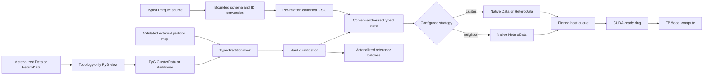

# Out-of-Core Parquet Graph Ingestion and GPU Streaming Design

## Status

Approved on 2026-07-31 for integration into the graph, heterogeneous graph,
and hypergraph core remediation plan.

## Objective

Support one large transductive **typed graph** whose per-type nodes, static
features, per-relation edges, and optional target-node supervision are stored
across small Parquet files. The same physical store must expose either a
homogeneous native PyG `Data` view or a multi-relational `HeteroData` view.
Conversion and training remain bounded-memory even when neither the complete
graph nor any complete feature matrix fits in RAM.

The training input pipeline overlaps disk reads, CPU batch assembly,
pinned-host staging, host-to-device transfer, and GPU compute for two explicit
strategies: graph-aware cluster unions for homogeneous graphs and
relation-aware target-seed neighbor sampling for heterogeneous graphs. It
measures input starvation continuously and reports evidence that separates an
input bottleneck from model, synchronization, or logging overhead.

## Current Gap

The current `GraphDataModule` consumes an already-materialized PyG `Data`
object. The previously approved `cluster_disk` follow-on permits initial
preprocessing to materialize the one source graph and uses PyG `ClusterData`
during partitioning. Its proposed runtime store is `manifest.json` plus
memory-mapped NumPy arrays.

That contract does not support a graph or embedding matrix larger than RAM.
The current packaged graph configurations also use `num_workers: 0` and
`pin_memory: false`. The disk-streaming plan specifies lazy worker reads but
not host queue depth, asynchronous CUDA transfer, device queue depth, or
continuous starvation measurements.

## Decisions

1. Parquet is a supported source and interchange format, not the hot training
   representation.
2. Selecting the Parquet typed-graph loader runs a strictly out-of-core
   conversion into one canonical typed CSC store.
3. A homogeneous graph is the one-node-type/one-relation case. Its output
   adapter removes synthetic type names and emits `Data`; a heterogeneous
   output adapter preserves node types and canonical relation triples and
   emits `HeteroData`.
4. Schema roles are mapped in YAML. Configuration does not execute arbitrary
   Python or SQL expressions.
5. Materialized homogeneous and heterogeneous inputs use PyG's partitioning
   implementations as the qualified reference path. Homogeneous mode first
   preserves and corrects the `dleko11:on_disk_transductive` `ClusterData`
   behavior; heterogeneous mode uses topology-only
   `torch_geometric.distributed.Partitioner`. The accepted typed partition book
   then drives both exact induced cluster unions and relation-specific
   `NeighborLoader` sampling from the universal store.
6. Static node features remain immutable dataset features. They are not
   optimizer-owned parameters and are not copied into checkpoints.
7. Both runtime strategies use the same bounded host and CUDA prefetch
   infrastructure, ordered sequence protocol, committed-cursor resume,
   telemetry, provenance, and prediction-export identity resolver.
8. The qualified large-graph profile defaults to three prefetched batches on
   the device. Input starvation is measured every step. Packaged runs warn;
   release qualification fails above the accepted stall boundary.

## Supported Source Shape

One logical graph is represented by typed Parquet datasets:

- one node dataset per node type, with one node ID per row and static features;
- one edge dataset per canonical relation `(source_type, relation,
  destination_type)`;
- optional labels and an explicit registry of one or more named train,
  validation, and test split sets for one configured target node type.

Each dataset may contain many files and row groups. IDs may be signed or
unsigned integers or UTF-8 strings. Each node type uses one exact ID type; ID
types may differ between node types. Floating, null, nested, and mixed-type
identifiers are rejected. IDs need not be contiguous or ordered and need only
be unique within their node type. The same external ID in two node types is
valid.

### Configuration contract

```yaml
dataset:
  loader:
    _target_: topobench.data.loaders.parquet.ParquetTypedGraphLoader
    parameters:
      output_kind: heterogeneous  # homogeneous or heterogeneous
      node_types:
        author:
          paths: ["${paths.data_dir}/authors/*.parquet"]
          columns:
            id: author_id
            features:
              column: embedding
              representation: fixed_size_list
        paper:
          paths: ["${paths.data_dir}/papers/*.parquet"]
          columns:
            id: paper_id
            features:
              columns: [feature_0, feature_1]
              representation: scalar_columns
      edge_types:
        - type: [author, writes, paper]
          paths: ["${paths.data_dir}/writes/*.parquet"]
          columns:
            source: author_id
            destination: paper_id
            edge_id: edge_id
            weight: null
            attributes: null
      supervision:
        target_node_type: paper
        labels:
          source: nodes          # nodes or dataset
          column: label
          paths: null
          node_id: null
        splits:
          active: split_01_01_1990
          sets:
            split_01_01_1990:
              train: splits/train_split_01_01_1990.parquet
              val: splits/val_split_01_01_1990.parquet
              test: splits/test_split_01_01_1990.parquet
              coverage: partial  # partial or complete
              qualified: true
      execution:
        mode: materialized_reference  # full_graph, materialized_reference, disk
      ingestion:
        record_batch_rows: 65536
        memory_limit: 4GB
        temp_directory: ${paths.data_dir}/tmp
      partition:
        backend: pyg
        num_partitions: 1500
        recursive: false
        memory_limit_bytes: 274877906944  # 256 GiB
        external_partition_map: null
      artifacts:
        save_reproducibility_bundle: true
      profiling:
        enabled: true
        sample_every_steps: 10
        emit_on_duration_delta: 0.10
        emit_on_memory_delta_bytes: 268435456
```

Homogeneous input uses the same schema with one declared node type, one
self-type relation, one target node type, and `output_kind: homogeneous`.
Validation rejects any other homogeneous topology.

Feature mapping accepts either one fixed-size list column or an explicit,
ordered list of scalar columns. Feature width and dtype are fixed per node
type; different node types may have different widths and dtypes.
Variable-length embeddings are rejected.

Labels may come from the configured target node dataset or a separately keyed
dataset. The recommended split filename stem is `{phase}_{unique_tag}`, for
example `train_split_01_01_1990`; every file remains explicitly registered
rather than discovered by filename. Each tag declares exactly one train,
validation, and test source. IDs are unique within a source and pairwise
disjoint across the three phases of that tag. `coverage: complete` requires
their union to equal the declared supervision population; `partial` permits
unsupervised target nodes. Overlap between different tags is allowed for
temporal splits, folds, and alternate experiments. A run selects exactly one
tag, while store qualification validates every tag marked `qualified: true`.

Paths are resolved and sorted canonically. A glob resolving to no files is an
error. Unknown configured columns, missing roles, duplicate per-type IDs,
duplicate relation rows without a stable edge identity/order role, null IDs,
unresolved typed endpoints, inconsistent schemas, non-finite features,
malformed targets, and invalid splits fail during conversion.

## Architecture



### Components

- `ParquetTypedGraphSpec`: frozen semantic schemas, split registry, output view,
  target type, partition/reproducibility/profiling policy, and resource limits.
- `ParquetTypedGraphIngestor`: staged DuckDB/Arrow scans and source
  fingerprinting shared by graph domains.
- `ExternalNodeIndex`: one disk-backed external-ID to dense-local-ordinal map
  per node type.
- `MaterializedPyGPartitioner`: topology-only PyG `ClusterData`/`Partitioner`
  invocation with resource preflight and trusted temporary output.
- `PyGPartitionArtifactAdapter` and `PartitionValidator`: immutable typed
  partition book plus identity/direction/hard-balance qualification.
- `TypedGraphStoreWriter`: writes typed arrays, relation CSC, splits,
  partitions, checks, and environment metadata; atomically promotes one
  content-addressed store.
- `StoreBundle`: digest-pinned, non-executable producer/consumer distribution
  with safe staging and validation.
- `TypedGraphStore`: manifest validation and lazy selected memory-mapped reads.
- `DiskFeatureStore` and `DiskGraphStore`: PyG protocol views over canonical
  relation CSC without runtime full-layout conversion.
- `HomogeneousClusterStrategy` and `HeterogeneousClusterStrategy`: exact
  partition-union `Data`/`HeteroData` materialization.
- `HeterogeneousNeighborStrategy`: relation-specific target-seed fanout through
  PyG `NeighborLoader`.
- `FittableTransform`: exactly-once training scan and immutable PCA/transform
  state followed by per-batch application.
- `DiskGraphDataModule`, `DevicePrefetchLoader`, and structured event/check
  sinks: shared lifecycle, bounded transfer, resume, profiling, and evidence.

DuckDB and PyArrow are direct dependencies of an explicit Parquet extra. They
are imported lazily so non-Parquet graph, heterogeneous, and hypergraph runs do
not acquire a runtime import dependency on them.

## Bounded-Memory Conversion

### Stage 1: inventory and preflight

Resolve source files, validate physical schemas, count rows, and compute source
file digests by streaming bytes. Estimate final-store and temporary disk usage.
Fail before expensive conversion when configured memory or disk limits cannot
support the request.

The source fingerprint includes canonical paths relative to the configured
root, byte sizes, SHA-256 digests, output kind, all node/relation semantic
schemas, target/split policy, dependency and representation versions, enabled
strategy capabilities, optional partition algorithm/options/seed, neighbor
fanout contract, and every behavior-changing ingestion parameter.

### Stage 2: per-type node mapping

For each node type, DuckDB creates one deterministic dense `int64` local
ordinal for every external node ID using its configured memory limit and
temporary directory. Ordering is canonical within that type's exact supported
Arrow ID type. Each mapping is unique and complete; ordinals from different
types occupy separate namespaces.

Runtime homogeneous batches expose the one type's canonical ordinal as
`global_nid`. Heterogeneous batches expose per-type local `n_id`; exported
prediction identity adds the target node type. The final store contains one
`node_ids.parquet` per type, mapping local ordinals back to original integer or
string IDs. External string IDs never enter PyTorch model batches.

### Stage 3: per-type features and target supervision

Arrow record batches validate each node type's features and optional fields.
Labels and splits are accepted only for the configured target node type.
Static features remain immutable. Data streams into disk-backed intermediate
state or directly into preallocated per-type arrays; no complete feature
matrix is constructed in memory.

Separate supervision files are externally joined against the target type's ID
map. Missing, duplicate, extra, or cross-type supervision rows fail according
to the declared supervision contract; implicit positional joins are
prohibited.

Every registered split tag is resolved through the target type's canonical ID
map. Duplicate IDs within one phase, overlap among train/validation/test within
one tag, missing target IDs, or incomplete coverage under `coverage: complete`
are hard failures. Overlap across distinct tags is permitted. The store retains
every validated tag; a run selects one active tag and records its three source
checksums.

### Stage 4: typed edge mapping and canonical CSC

For each canonical relation, DuckDB externally joins source IDs through the
source-type map and destination IDs through the destination-type map. Missing
endpoints fail rather than creating implicit nodes. Mapped rows are externally
sorted by `(destination_local_ordinal, source_local_ordinal, edge_id)` and
streamed directly into destination-oriented CSC `colptr` and `row` arrays.

Direction is never inferred or symmetrized. Reverse message flow requires an
explicit reverse relation in the manifest. Duplicate endpoints require a
stable configured `edge_id`/order role or are rejected. Every weight,
attribute, and edge field stays aligned through canonical `edge_id`. Store
promotion verifies relation cardinalities, endpoint bounds, CSC monotonicity,
and field alignment independently for every relation.

### Stage 5: qualified typed partition generation

The first supported partition-production path deliberately reuses PyG. For
homogeneous graphs it preserves and corrects the
`dleko11:on_disk_transductive` `ClusterData` behavior. For heterogeneous graphs
it constructs a topology-only `HeteroData` containing only per-type
`num_nodes` and authoritative relation `edge_index` tensors, then invokes
`torch_geometric.distributed.Partitioner.generate_partition()` unchanged.
Static features, labels, split masks, edge attributes, and model state never
enter the partitioner.

METIS receives a temporary undirected scoring view. Existing reverse canonical
relations are reused; missing reverse arcs exist only in that view. The typed
authoritative graph remains directed, and validation rejects any temporary arc
or relation that leaks into it. A Parquet conversion may materialize this
topology-only view when its estimate fits the configured limit, which defaults
to 256 GiB (`274877906944` bytes). It records measured peak RSS and temporary
disk. Above the limit, conversion requires a validated external partition map
or an explicitly raised limit; there is no random/hash fallback.

A `PyGPartitionArtifactAdapter` converts trusted local PyG output into one
immutable `TypedPartitionBook`: per-type assignments, permutations, pointers,
per-relation edge ownership, source topology fingerprint, backend versions,
options, balance, and cut statistics. It proves every typed node appears once,
all IDs round-trip, every original edge retains its canonical relation and
direction, and every configured hard balance bound passes for each split tag
marked `qualified`. A rejected candidate remains diagnostic and is never
promoted.

METIS reruns are not assumed to reproduce the same assignments. Reproducibility
therefore persists and checksums the accepted partition book; independent
repartitioning produces a new artifact identity.

### Stage 6: final layout and atomic promotion

Homogeneous and heterogeneous cluster layouts retain canonical type-local IDs
and use the typed partition book to select exact induced unions. Neighbor mode
uses the same book for partition-local target scheduling while traversing the
authoritative relation CSC as needed. All layouts use stable collision-safe
internal keys (`n0000`, `r0000`, ...) mapped to exact type/relation names in
non-executable `manifest.json`; arbitrary names never become unchecked
filesystem paths.

The writer builds under `stores/.staging/<build-id>` and validates all
per-type/per-relation checksums, cross-references, split identities, partition
invariants, and reference parity. It hashes the canonical manifest and file
digests, then performs a same-filesystem atomic rename to
`stores/<content-sha256>`. Consumers therefore see no final store or one
complete validated store, never a partial one. A crash leaves only ignored,
deletable staging state.

A cache hit requires the requested source/configuration identity to resolve to
an existing promoted content hash whose manifest and checksums validate.
Directory presence alone is not a hit. Corrupt stores are quarantined; changed
source, schema, dependency, split registry, partition book, output kind,
strategy capability, transform state, or conversion option creates a new
identity rather than overwriting old content.

Peak conversion memory is bounded by configured Arrow batches, DuckDB's memory
limit, the admitted topology-only partition view, and fixed buffers. Temporary
storage may grow as $O(V+E)$ and is reported explicitly.

## Universal Typed Runtime Store

The non-executable physical store contains:

```text
manifest.json
qualification_report.json
build_environment.json
splits/
  <tag>/{train,val,test}_ids.npy
nodes/
  n0000/
    x.npy
    node_ids.parquet
    fields/*.npy
    y.npy
  n0001/...
relations/
  r0000/
    colptr.npy
    row.npy
    edge_id.npy
    fields/*.npy
  r0001/...
partitions/
  node_types/n0000/
    assignment.npy
    permutation.npy
    partptr.npy
  relations/r0000/
    edge_partition.npy
  partition_book.json
  statistics.json
transform_states/
  <state-fingerprint>/
    manifest.json
    arrays/*.npy
```

The manifest maps internal keys to exact node names and relation triples and
records output kind, target node type, all schemas, dtypes, shapes, checksums,
all split tags and fingerprints, partition-book identity, representation
version, supported strategy capabilities, qualification status, and producer
environment. Backend provenance includes Python, PyTorch, PyG,
`torch-sparse`/`pyg-lib`, METIS implementation/build, partition options,
source commit/dirty-patch digest, dependency-lock digest, OS/architecture, and
CUDA/driver/container-image information when applicable.

Parquet input remains untouched. Runtime never repeatedly scans, decompresses,
or joins source Parquet. Memory-mapped CSC and aligned arrays are the hot
format. One physical store exposes:

- homogeneous and heterogeneous selected-partition APIs that emit writable
  native `Data` or `HeteroData` exact induced unions with canonical IDs;
- PyG `FeatureStore`/`GraphStore` views that return selected per-type features
  and prebuilt per-relation CSC to `NeighborLoader`, which emits native
  writable `HeteroData`.

Workers open arrays lazily after spawn. Cluster materialization reads selected
typed partition memberships, reconstructs the exact induced union by retaining
only edges whose source and destination are selected, preserves every
authoritative relation direction and aligned field, and attaches canonical
IDs. Neighbor materialization is owned by PyG's sampler/filter path over the
same typed store. No complete feature matrix, mapped edge table, or
authoritative `Data`/`HeteroData` copy is required by disk runtime.
The store never persists transformed batches.

## Reproducibility and Pre-Partitioned Distribution

`artifacts.save_reproducibility_bundle` defaults to `true` and is mandatory for
qualified runs. Disabling it is permitted only through the explicit
experimental profile and marks every result and logger record unqualified. The
bundle retains resolved configuration, source commit and dirty-patch digest,
dependency lock, environment and hardware record, RNG/determinism settings,
store and partition references, split registry, fitted-transform states,
checkpoint references, qualification report, and a checksum manifest.

Environment provenance makes the software environment reconstructable. It
does not falsely promise bitwise equality across unlike accelerators. Each run
declares `bitwise`, `numerically_equivalent`, or `unqualified` reproduction
status with concrete requirements and reasons. Exact replay uses the saved
partition book rather than invoking METIS again.

The pre-partitioned workflow separates production from consumption. A
high-memory producer validates the source and split registry, generates and
qualifies the partition book, publishes the immutable non-executable store,
and records its content digest. A training machine downloads the declared
digest, safely extracts it into staging with resolved-path containment checks,
validates schemas, sizes, checksums, CSC and identity invariants, atomically
promotes it, and trains from memory maps without loading or repartitioning the
source graph. Downloaded pickle/`.pt` partition caches are never trusted as
published stores.

## Runtime and Fitted Transform Boundary

An immutable `BatchTransformSpec` declares native input/output kind,
determinism, device requirement, node/supervision identity preservation,
feature-width behavior, and edge effects. A runtime transform executes exactly
once after native `Data`/`HeteroData` assembly and canonical identity
attachment, and before pinning or device transfer. A transform that removes or
reorders entities must return an explicit checked identity mapping; implicit
identity mutation is rejected.

A separate `FittableTransform` lifecycle supports PCA and related experiments:
`begin_fit`, bounded `update_fit`, `finalize_fit`, and `transform`. The fit view
enumerates every active-tag training entity exactly once in canonical order;
it never fits through cluster batches, whose context nodes may repeat, and it
never reads validation or test rows. Incremental PCA may therefore learn one
mean/projection state in a bounded pre-training pass and apply that immutable
state on the fly to all phases.

The fitted-state cache key covers store fingerprint, active split tag and
training-source checksum, transform class/code fingerprint, complete
configuration, input schema/dtype, implementation versions, and numeric
precision. State is serialized as validated JSON plus non-executable arrays,
atomically promoted, checksum-referenced by checkpoints and reproducibility
artifacts, and never silently reused after any key changes. Supervised fitted
transforms must explicitly declare label access and can consume training labels
only.

## Host and Device Prefetch

The large-graph profile uses two independently bounded queues:

```yaml
dataloader_params:
  num_workers: 8
  persistent_workers: true
  prefetch_factor: 3
  pin_memory: true
  clusters_per_batch: 4
  max_batch_nodes: 250000
  max_batch_edges: 2000000
  host_prefetch_budget_mb: 16384
  device_prefetch_batches: 3
  device_prefetch_budget_mb: 8192
```

Worker processes read and assemble `Data` or `HeteroData` batches
concurrently. PyTorch's ordered worker queue holds at most
`num_workers * prefetch_factor` results. Pinned-host staging prepares writable
tensors for direct transfer.

`DevicePrefetchLoader` extends PyG's one-look-ahead prefetch concept with one
generic configurable ordered ring for both native output kinds. The qualified
large-graph profile defaults to three batches ahead, plus the batch currently
computing. A dedicated CUDA stream copies ready batches while the default
stream computes. Lightning receives an already-device-resident batch and
performs no second copy.

Device depth absorbs latency jitter; it cannot compensate for input production
slower than compute on average. The queue remains ordered by sampler sequence
ID. CPU and MPS runs retain host prefetch but disable CUDA-stream prefetch with
an explicit status message. Distributed cluster or neighbor sampling remains
out of scope.

Worst-case bytes are derived from node/edge caps, stored field schemas, and the
runtime transform spec. Startup rejects queue settings whose conservative
host or device footprint exceeds the configured budgets. A sampled union that
exceeds a cap fails before pinning or CUDA transfer. The loader never silently
reduces batch size, cluster count, transform output width, worker count, or
queue depth.

## Sampler and Checkpoint Semantics

Prefetch causes either strategy to issue descriptors before the model consumes
them. One shared sequence protocol therefore records separate cursors:

- `issued_cursor`: descriptors assigned to workers or device prefetch;
- `committed_cursor`: the last descriptor group whose optimizer step
  completed.

Every batch carries a monotonic sequence ID. Cluster descriptors carry selected
partition IDs and the active split tag; neighbor descriptors carry target type,
target seed IDs, split tag, and deterministic relation-sampler state. Gradient
accumulation collects pending sequence IDs. A Lightning hook commits that
ordered group only after observing a successful optimizer/global-step advance;
skipped steps, exceptions, and pre-step checkpoints leave it uncommitted.

Checkpoints persist immutable store, partition-book, split-tag, and fitted-
transform identities plus committed cursor, RNG, evaluator, and strategy state,
never issued state. Issued or prepared but uncommitted descriptors are
regenerated after resume. Worker completion may occur out of order, but
delivery and commit remain ordered. Validation/test use deterministic
phase-specific descriptor order and do not mutate training commit state.

Qualification interrupts before issue, after issue, after collation, after
backward, around optimizer/global-step commit, and after committed gradient-
accumulation groups. Interrupted and uninterrupted runs must consume the same
remaining descriptors and agree exactly on sampler/evaluator counts and
sequence; model, optimizer, scheduler, selected checkpoint, final metrics, and
prediction identities must meet their declared exact or numeric-equivalence
contract.

## Structured Profiling and Input-Starvation Monitoring

One execution event stream covers inventory, joins, partition generation,
validation, publication, fitted-transform passes, worker reads, batch assembly,
pinning, H2D, model compute, evaluator, checkpoint, and artifact writes. Events
carry stable operation/check ID, phase, split tag, epoch/global step,
descriptor sequence, wall and monotonic time, duration, row/node/edge/byte
counts, RSS/pinned/GPU/temporary-disk state, queue depths, configured deltas,
status, and remediation/report references.

```yaml
profiling:
  enabled: true
  sample_every_steps: 10
  emit_on_duration_delta: 0.10
  emit_on_memory_delta_bytes: 268435456
  local_event_log: true
  logger_summary: true
dataloader_params:
  input_monitor:
    warmup_steps: 20
    rolling_window_steps: 100
    max_input_stall_fraction: 0.05
    max_consecutive_starved_steps: 3
    patience_windows: 2
    action: warn
```

The rotated, bounded local event log and immutable summaries are authoritative.
W&B and other logger adapters receive sampled/aggregated system metrics and
failed-check artifacts, never raw IDs or an unbounded hot-path event stream.
CUDA events are resolved asynchronously; profiling must not call
`torch.cuda.synchronize()` in the hot path.

The primary input statistic is

$$
\text{input stall fraction}
=
\frac{\text{time waiting for device-ready data}}
{\text{wait time}+\text{compute time}}.
$$

After warm-up, a rolling stall fraction above 5%, three consecutive starved
steps, or two bad windows emits a structured warning. Packaged runs warn; the
strict release profile fails. Correctness failures such as dead workers,
sequence gaps, invalid batches, queue corruption, or CUDA-copy failures always
raise. System metrics live under `system/*`, never participate in scientific
metric selection, and never auto-tune a qualified run.

Run provenance records p50/p95/p99 operation timings, conversion and selected-
read throughput, starvation count, queue depths, estimated/measured partition
RSS, temporary-disk peak, final-store size, pinned-host peak, GPU peak, and
achieved stall fraction.

## Error Handling, Check Evidence, and Resource Ownership

Every validation has a stable check ID such as `SPLIT-DISJOINT-001`,
`IDENTITY-BIJECTION-001`, `RELATION-DIRECTION-001`,
`PARTITION-BALANCE-001`, `STORE-CHECKSUM-001`, or `RESUME-CURSOR-001`.
Its structured record contains phase, status, expected/observed values,
evidence, remediation, documentation reference, and local report path. A hard
failure starts its exception with that ID, identifies the affected
type/relation/split/file without exposing secrets, points to
`qualification_report.json`, and prevents promotion or qualified execution.
Checks never exist only as console prose.

Source mutation, schema/ID/relation/feature/target/split errors, malformed PyG
partition output, topology-fingerprint mismatch, hard balance failure,
insufficient RAM/disk, checksum failure, and unsupported capability
combinations fail at their narrowest boundary. Full ID bijection and
source-versus-partition counts run during build, download validation,
promotion, first uncached open, and explicit deep audit—not every epoch.
Runtime batches use cheap range, uniqueness, shape, and participant-count
checks.

Worker exceptions propagate with sequence and cluster/seed descriptor. Early
shutdown drains queues, terminates workers, closes maps, and releases pinned/
device buffers. Allocation failures report estimate, observation, queue state,
native kind, and budgets. Unsupported async devices explicitly use host-only
mode.

## Testing and Qualification

Tests use exact assertions for identities, counts, shapes, dtypes, relations,
directions, cursors, manifests, and checksums. Floating-point assertions declare
dtype-justified absolute/relative tolerances. Each test has a concise
behavioral docstring and comments explaining non-obvious fixture topology and
the invariant/failure it protects; comments do not narrate syntax.

1. Validate multiple explicit split tags, unique phase filenames, per-file
   uniqueness, pairwise train/validation/test disjointness within each tag,
   complete/partial coverage, legal overlap across tags, and active-tag
   artifact identity.
2. Round-trip arbitrary typed integer/string IDs, different feature widths and
   dtypes, directed relations, edge fields, parallel edges, isolated nodes,
   explicit/missing reverse relations, and duplicate endpoint pairs exactly.
3. Prove type-local -> temporary-global -> partition/permuted -> type-local is
   a complete bijection; per-partition counts sum to the source counts.
4. Feed equivalent data through different files/row groups; semantic store
   digests match.
5. Prove topology-only PyG inputs contain no features, labels, masks, edge
   fields, or model state; temporary reverse arcs never leak.
6. Reject every malformed source, split, partition map, relation direction,
   checksum, staging, transform-state, and cache-hit case by exact check ID.
7. Preserve and qualify corrected homogeneous behavior from pinned
   `dleko11:on_disk_transductive` commit
   `b55b876a3bb227fdc5a79b776b6e8d337ff5fe02`, including canonical
   `perm_to_global` identity rather than permuted row positions.
8. Qualify PyG heterogeneous partition reconstruction and every configured
   hard per-type, per-phase, per-relation, feature-byte, empty-partition, and
   maximum-size bound.
9. Compare each materialized heterogeneous cluster union against
   `HeteroData.subgraph(subset_dict)` and each disk union against that same
   oracle: exact nodes, canonical relations/directions, edge IDs, features,
   fields, labels, masks, and participant counts.
10. Compare materialized and disk `NeighborLoader` with identical seed order,
    fanout, replacement/direction settings, and generator state. Qualified
    deterministic mode requires exact ordered target, per-type node, per-
    relation edge, hop, field, supervision, and participant identities; a
    backend that cannot provide this fails rather than weakening to set parity.
11. Cover asymmetric fanout, multiple hops, replacement on/off, zero-fanout
    relations, isolated/noncontiguous seeds, high-degree nodes, duplicate
    endpoints, reverse relations, final short batches, multiple workers,
    prefetch, reload, moved stores, and resume.
12. Fit PCA from an exactly-once canonical training scan, prove validation/test
    leakage is impossible, atomically reuse matching state, reject every cache-
    key mismatch, and reproduce projected batches after download/resume.
13. Compare interrupted and uninterrupted cluster/neighbor runs at every issue,
    prepare, consume, optimizer, accumulation, evaluator, and commit boundary.
14. Complete finite native GCN and HGT optimization steps in materialized and
    disk modes.
15. Require exact full-graph logits/metrics when a cluster union selects all
    partitions and when exhaustive neighbor fanout produces the complete target
    computation graph, within the declared numeric profile.
16. For realistic sampled training, run paired seeds, publish every result,
    mean, standard deviation, confidence interval, and paired difference, and
    enforce a predeclared maximum degradation against each strategy's
    materialized reference. Tolerances are never chosen after observing data.
17. Prove reproducibility-bundle default/mandatory behavior for fresh, cached,
    downloaded, interrupted/resumed, moved, multi-split, and second-process/
    machine scenarios; any changed input creates explicit identity rejection.
18. Convert sources exceeding a subprocess RSS ceiling; record estimated and
    measured partition RSS, DuckDB memory, temporary disk, and final size.
19. Prove lazy worker ownership, bounded selected reads, bounded host/device
    queues, clean early teardown, and CUDA overlap at depths one and three.
20. Fail strict release qualification above 5% steady-state input stall and
    retain the complete structured check/profiling evidence.

## Dependency and Configuration Boundary

Parquet support is selected explicitly by dataset loader and TopoBench data
pipeline configuration. It is not activated for ordinary in-memory PyG
datasets. DuckDB and PyArrow are pinned direct dependencies of the Parquet
extra and are included in its CI and clean-environment qualification.

The runtime store and loader do not import DuckDB or PyArrow unless
external-ID export is requested. Core graph training continues to depend only
on native PyTorch, PyG, NumPy, and surviving dependencies. Materialized typed
partitioning and heterogeneous disk neighbor mode require qualified PyG
partition and sampling backends respectively; capability probes record the
actual `torch-sparse`/`pyg-lib` path.

## Non-goals

- Direct Parquet queries in the per-batch training hot path.
- Trainable or mutable node embeddings stored in Parquet.
- Arbitrary SQL or Python expressions in dataset YAML.
- Multi-graph disk batching.
- Remote object-store memory mapping in the first implementation.
- Distributed Cluster-GCN or distributed conversion.
- Automatic mutation of queue depth, worker count, or batch shape during a
  qualified run.
- Pretending exact induced cluster unions and relation-specific neighbor
  sampling are equivalent estimators; only explicitly exhaustive
  configurations have an exact cross-strategy equality contract.
- A guarantee of high GPU utilization when stalls originate in model kernels,
  synchronization, logging, callbacks, or optimizer work rather than input.
