# Out-of-Core Parquet Graph Ingestion and GPU Streaming Design

## Status

Approved on 2026-07-31 for integration into the graph, heterogeneous graph,
and hypergraph core remediation plan.

## Objective

Support one large transductive homogeneous graph whose nodes, static
embeddings, edges, and optional supervision are stored across small Parquet
files. Conversion and training must remain bounded-memory even when neither the
complete graph nor the complete embedding matrix fits in RAM.

The training input pipeline must overlap disk reads, CPU batch assembly,
pinned-host staging, host-to-device transfer, and GPU compute. It must measure
input starvation continuously and report enough evidence to distinguish an
input bottleneck from model, synchronization, or logging overhead.

## Current Gap

The current `GraphDataModule` consumes an already-materialized PyG `Data`
object. The previously approved `cluster_disk` follow-on permits initial
preprocessing to materialize the one source graph and uses PyG `ClusterData`
during partitioning. Its proposed runtime store is `manifest.json` plus
memory-mapped NumPy arrays.

That contract does not support a graph or embedding matrix larger than RAM.
The current packaged graph configurations also use `num_workers: 0` and
`pin_memory: false`. The disk-streaming plan specifies lazy worker reads but
not host queue depth, asynchronous CUDA transfer, device queue depth, or
continuous starvation measurements.

## Decisions

1. Parquet is a supported source and interchange format, not the hot training
   representation.
2. Selecting the Parquet graph loader runs a strictly out-of-core conversion
   into the canonical partitioned CSR store.
3. Schema roles are mapped in YAML. Configuration does not execute arbitrary
   Python or SQL expressions.
4. TopoBench computes graph-aware partitions without materializing PyG
   `Data` or invoking PyG `ClusterData`.
5. Static node embeddings remain immutable dataset features. They are not
   optimizer-owned parameters and are not copied into checkpoints.
6. Runtime uses bounded host and CUDA prefetch queues. The qualified
   large-graph profile defaults to three batches ahead on the device.
7. Input starvation is measured every step. Packaged runs warn rather than
   abort, while release qualification fails when the representative workload
   exceeds the accepted stall boundary.

## Supported Source Shape

One logical graph is represented by separate Parquet datasets:

- a node dataset with one unique node ID per row and static features;
- an edge dataset with source and destination node IDs per row;
- optional labels and split data in node columns or in a separate keyed
  Parquet dataset.

Each dataset may contain many files and row groups. Node IDs may be signed or
unsigned integers or UTF-8 strings. A dataset uses one exact ID type; floating,
null, nested, and mixed-type identifiers are rejected. IDs need not be
contiguous or ordered.

### Configuration contract

```yaml
dataset:
  loader:
    _target_: topobench.data.loaders.graph.parquet.ParquetGraphLoader
    parameters:
      nodes:
        paths: ["${paths.data_dir}/nodes/*.parquet"]
        columns:
          id: node_id
          features:
            column: embedding
            representation: fixed_size_list
      edges:
        paths: ["${paths.data_dir}/edges/*.parquet"]
        columns:
          source: src
          destination: dst
          weight: null
          attributes: null
      supervision:
        labels:
          source: nodes          # nodes or dataset
          column: label
          paths: null            # required for source: dataset
          node_id: null          # required for source: dataset
        split:
          source: nodes          # nodes, dataset, or generated
          mode: categorical      # categorical or masks
          column: split
          values:
            train: train
            val: validation
            test: test
      ingestion:
        record_batch_rows: 65536
        memory_limit: 4GB
        temp_directory: ${paths.data_dir}/tmp
        num_partitions: 1500
        partition_seed: 0
```

Feature mapping accepts either one fixed-size list column or an explicit,
ordered list of scalar columns. Feature width and dtype must be constant.
Variable-length embeddings are rejected.

Labels may come from the node dataset or a separately configured dataset
joined by node ID. Splits may use one categorical column, three explicit mask
columns, a separate keyed dataset, or the existing deterministic generated
split policy. The resulting `train_mask`, `val_mask`, and `test_mask` remain
full-length, non-empty, boolean, and pairwise disjoint.

Paths are resolved and sorted canonically. A glob resolving to no files is an
error. Unknown configured columns, missing roles, duplicate node or
supervision IDs, null IDs, unresolved edge endpoints, inconsistent schemas,
non-finite features, malformed targets, and invalid masks fail during
conversion.

## Architecture

```mermaid
flowchart LR
  P[Node and edge Parquet datasets] --> I[Schema validation and fingerprint]
  I --> M[Disk-backed external-ID map]
  M --> C[Mapped externally sorted CSR]
  C --> F[Streaming graph partitioner]
  F --> R[Partition-order rewrite]
  R --> S[Immutable cluster_disk store]
  S --> H[Pinned-host batch queue]
  H --> D[CUDA-ready ring]
  D --> G[Model compute]
```



### Components

- `ParquetGraphSpec`: frozen, validated semantic schema and resource limits.
- `ParquetGraphIngestor`: owns staged DuckDB/Arrow scans and source
  fingerprinting.
- `ExternalNodeIndex`: disk-backed external-ID to dense-ordinal mapping.
- `StreamingGraphPartitioner`: deterministic, bounded-memory graph-aware
  assignment.
- `GraphPartitionStoreWriter`: atomically writes the final runtime artifact.
- `GraphPartitionStore`: validates metadata and exposes lazy selected reads.
- `ClusterDiskBatchLoader`: samples clusters and assembles native PyG `Data`
  batches in workers.
- `DevicePrefetchLoader`: ordered, bounded CUDA prefetch ring.
- `InputPipelineMonitor`: asynchronous timings, queue telemetry, warnings, and
  provenance summaries.

DuckDB and PyArrow are direct dependencies of an explicit Parquet extra. They
are imported lazily so non-Parquet graph, heterogeneous, and hypergraph runs do
not acquire a runtime import dependency on them.

## Bounded-Memory Conversion

### Stage 1: inventory and preflight

Resolve source files, validate physical schemas, count rows, and compute source
file digests by streaming bytes. Estimate final-store and temporary disk usage.
Fail before expensive conversion when configured memory or disk limits cannot
support the request.

The source fingerprint includes canonical paths relative to the configured
root, byte sizes, SHA-256 digests, resolved semantic schema, supervision and
split policy, dependency versions, representation version, partition
algorithm/options/seed, and every behavior-changing ingestion parameter.

### Stage 2: node mapping

DuckDB creates one deterministic dense `int64` ordinal for every external node
ID using its configured memory limit and temporary directory. Ordering is
canonical within the exact supported Arrow ID type. The mapping is unique and
complete.

Runtime batches use this canonical ordinal as `global_nid`. The final store
also contains `node_ids.parquet`, mapping each ordinal back to the original
integer or string ID for prediction export and auditing. External string IDs
never enter PyTorch batches.

### Stage 3: features and supervision

Arrow record batches validate embeddings, labels, and split values. Static
embeddings remain immutable. Data is streamed into disk-backed intermediate
state or directly into preallocated output arrays; a complete feature matrix
is never constructed in memory.

Separate supervision files are externally joined by node ID. Missing,
duplicate, or extra supervision rows are handled according to the declared
supervision contract; implicit positional joins are prohibited.

### Stage 4: edge mapping and temporary CSR

DuckDB externally joins both edge endpoints against the node index. Missing
endpoints fail rather than creating implicit nodes. Mapped edges are externally
sorted by source and destination and streamed into a temporary CSR. Duplicate
edge handling, self-loop policy, edge order, and edge-field alignment follow an
explicit source contract and participate in the fingerprint.

### Stage 5: streaming partitioning

The initial implementation uses a deterministic, Fennel-style graph-aware
partitioner with a hard balance cap. It scans disk CSR, stores node assignments
in a memory-mapped integer array, and keeps only partition counters and bounded
working buffers in RAM. Directed edges are treated as undirected for partition
scoring; the original directed edge set is preserved in the runtime store.

Tie-breaking is deterministic and seed-controlled. The implementation records
balance and cut statistics and must beat a declared deterministic hash baseline
on the representative community-structured qualification graph. It must not
silently fall back to hash or range partitioning.

### Stage 6: final rewrite and promotion

Nodes are ordered by `(partition_id, dense_ordinal)`. Edges are remapped to the
partition order and externally sorted once more. The writer emits aligned
arrays sequentially, validates all checksums and invariants, then atomically
promotes the complete store from a locked temporary sibling directory.

Validated conversion stages may resume only when the exact source and
configuration fingerprint matches. A changed source, schema, dependency
version, or conversion option invalidates staged state. Partial final stores
are never exposed to a loader.

Peak application memory is bounded by configured Arrow batches, DuckDB's
memory limit, partition counters, and fixed buffers. Temporary storage may grow
as $O(V+E)$ and is reported explicitly.

## Runtime Store

The non-executable store contains:

- `manifest.json` with schema, provenance, shapes, dtypes, checksums, partition
  statistics, and resource estimates;
- `partptr.npy` for contiguous partition boundaries;
- CSR `indptr.npy` and `indices.npy`;
- `perm_to_global.npy` containing canonical dense ordinals;
- `node_ids.parquet` mapping ordinals to external IDs;
- `x.npy`, labels, all three masks, and declared node fields;
- aligned edge-weight and edge-attribute arrays when configured.

Parquet input remains untouched. The runtime does not repeatedly scan,
decompress, or join source Parquet. Memory-mapped CSR and arrays remain the hot
format because cluster unions need selected adjacency-row and aligned-feature
reads, not columnar table scans.

Each worker opens store arrays lazily after spawn. It copies only selected
slices into writable tensors, reconstructs the induced union including edges
between co-sampled clusters, and emits native PyG `Data`. The store never
persists transformed batches.

## Runtime Transform Boundary

The optional runtime transform remains graph-to-graph and executes exactly
once in the worker after the loader attaches `global_nid`, phase masks, labels,
and edge fields. It executes before pinning or device transfer.

Only transforms with an immutable `BatchTransformSpec` qualify. The spec
states graph input/output, determinism, device requirement, node and
supervision identity preservation, feature-width behavior, and edge effects.
Missing metadata, stochastic transforms, device transforms, node-count
changes, and supervision mutations are rejected from the qualified path.

## Host and Device Prefetch

The large-graph profile uses two independently bounded queues:

```yaml
dataloader_params:
  num_workers: 8
  persistent_workers: true
  prefetch_factor: 3
  pin_memory: true
  clusters_per_batch: 4
  max_batch_nodes: 250000
  max_batch_edges: 2000000
  host_prefetch_budget_mb: 16384
  device_prefetch_batches: 3
  device_prefetch_budget_mb: 8192
```

Worker processes read and assemble batches concurrently. PyTorch's ordered
worker queue holds at most `num_workers * prefetch_factor` results. Pinned-host
staging prepares writable tensors for direct transfer.

`DevicePrefetchLoader` extends PyG's one-look-ahead prefetch concept with a
configurable ordered ring. The qualified large-graph profile defaults to three
batches ahead, plus the batch currently computing. A dedicated CUDA stream
copies ready batches while the default stream computes. Lightning receives an
already-device-resident batch and performs no second copy.

Device depth absorbs latency jitter; it cannot compensate for input production
that is slower than compute on average. The queue remains ordered by sampler
sequence ID. CPU and MPS runs retain host prefetch but disable CUDA-stream
prefetch with an explicit status message. Distributed Cluster-GCN remains out
of scope.

Worst-case bytes are derived from node/edge caps, stored field schemas, and the
runtime transform spec. Startup rejects queue settings whose conservative
host or device footprint exceeds the configured budgets. A sampled union that
exceeds a cap fails before pinning or CUDA transfer. The loader never silently
reduces batch size, cluster count, transform output width, worker count, or
queue depth.

## Sampler and Checkpoint Semantics

Prefetch causes the sampler to issue batches before the model consumes them.
The sampler therefore records separate cursors:

- `issued_cursor`: batches assigned to workers or device prefetch;
- `committed_cursor`: the last batch whose optimizer step completed.

Every batch carries a monotonic sequence ID and its cluster IDs. Checkpoints
persist state at the committed cursor, not the issued cursor. After resume,
issued-but-uncommitted batches are regenerated. Worker completion may occur
out of order, but delivery and commit remain ordered.

Interrupted and uninterrupted training with the same fingerprint must consume
the same committed cluster sequence and reach equivalent model, optimizer,
scheduler, and metric state.

## Continuous Input-Starvation Monitoring

```yaml
dataloader_params:
  input_monitor:
    enabled: true
    warmup_steps: 20
    rolling_window_steps: 100
    max_input_stall_fraction: 0.05
    max_consecutive_starved_steps: 3
    patience_windows: 2
    action: warn
```

Measure every batch:

- wait time for the next device-ready batch;
- disk read and CPU assembly duration;
- pinned-host and device-ready queue depths;
- H2D duration from CUDA events;
- model-step compute duration from CUDA events;
- bytes, node count, edge count, sequence ID, and cluster IDs.

The primary statistic is

$$
\text{input stall fraction}
=
\frac{\text{time waiting for device-ready data}}
{\text{wait time}+\text{compute time}}.
$$

CUDA events are recorded every step but resolved asynchronously. The monitor
must not call `torch.cuda.synchronize()` in the hot path. Queue-empty events are
recorded immediately.

After warm-up, a rolling input-stall fraction above 5%, three consecutive
starved steps, or two bad windows emits a structured warning. Packaged runs use
`action: warn`; an explicit strict operational profile may select `error`.
Correctness failures such as dead workers, sequence gaps, invalid batches,
queue corruption, or CUDA-copy failures always raise.

Metrics use a separate `system/input/*` namespace and never participate in
scientific metric selection or best-checkpoint logic. Warnings include recent
queue depths, I/O throughput, H2D and compute timing, batch dimensions,
sequence ID, and cluster IDs. The monitor diagnoses but never auto-tunes a
running qualified experiment.

Run provenance records p50/p95/p99 wait, assembly, H2D and compute time,
starvation count, queue depths, resolved prefetch settings, peak pinned-host
bytes, GPU peak memory, and achieved stall fraction.

## Error Handling and Resource Ownership

- Source mutation during conversion invalidates the staging run.
- Schema, ID, endpoint, feature, target, split, or checksum errors fail before
  a runtime loader is built.
- Insufficient temporary or final disk capacity fails during preflight.
- Worker exceptions propagate with sequence and cluster IDs.
- Early iterator shutdown, trainer exceptions, and normal teardown drain
  queues, terminate workers, close memory maps, and release pinned/device
  buffers.
- CUDA allocation failures report estimated and observed batch bytes, queue
  depth, and configured budgets.
- Unsupported async devices use explicit host-only mode; they never pretend to
  qualify CUDA overlap.

## Testing and Qualification

1. Round-trip arbitrary integer and string IDs, fixed embeddings, labels,
   masks, directed edges, weights, and attributes exactly.
2. Feed equivalent data through different file and row-group layouts; final
   semantic store digests must match.
3. Cover labels and splits from node columns, separate datasets, and generated
   deterministic splits.
4. Reject missing/duplicate IDs, unresolved endpoints, variable feature width,
   non-finite values, schema drift, malformed masks, corrupt arrays, source
   mutation, and stale staging state.
5. Convert a graph whose graph plus embedding size exceeds a subprocess RSS
   ceiling by a substantial factor. Record DuckDB memory and temporary-disk
   peaks.
6. Verify partition determinism, hard balance, edge preservation, and the
   declared cut-quality threshold against the hash baseline.
7. Prove workers open arrays lazily, preserve selected-read behavior, deliver
   batches in sequence, and release all resources after full iteration and
   early shutdown.
8. Compare interrupted and uninterrupted runs after prefetched batches have
   been issued but not committed.
9. On a CUDA runner, compare synchronous loading, host-only prefetch, and device
   depths 1 and 3. Use profiler traces to prove disk/CPU work and H2D transfer
   overlap compute.
10. Fail release qualification when the representative steady-state workload
    exceeds the 5% input-stall boundary, even though ordinary packaged runs
    only warn.
11. Record throughput, p50/p95/p99 timings, peak RSS, pinned-host memory, GPU
    memory, temporary-disk peak, final-store size, and starvation events as
    release evidence.

## Dependency and Configuration Boundary

Parquet support is selected explicitly by dataset loader/configuration. It is
not activated for ordinary in-memory PyG datasets. DuckDB and PyArrow are
pinned direct dependencies of the Parquet extra and are included in its CI and
clean-environment qualification.

The runtime store and loader do not import DuckDB or PyArrow unless external-ID
export is requested. Core graph training continues to depend only on native
PyTorch, PyG, NumPy, and the surviving core dependencies.

## Non-goals

- Direct Parquet queries in the per-batch training hot path.
- Trainable or mutable node embeddings stored in Parquet.
- Arbitrary SQL or Python expressions in dataset YAML.
- Multi-graph disk batching.
- Remote object-store memory mapping in the first implementation.
- Distributed Cluster-GCN or distributed conversion.
- Automatic mutation of queue depth, worker count, or batch shape during a
  qualified run.
- A guarantee of high GPU utilization when stalls originate in model kernels,
  synchronization, logging, callbacks, or optimizer work rather than input.
