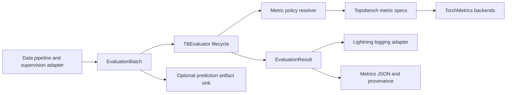

# Scalable Exact and Online Evaluator Design

## Status

Approved on 2026-07-31 for integration into the reduced graph,
heterogeneous-graph, and hypergraph TopoBench core.

This design refactors the current `TBEvaluator`; it does not create a second
evaluation framework. It also adds an automatic pre-training dry-run gate.

## Objective

Provide one TopoBench-owned evaluation boundary that:

- supports graph classification, scalar graph regression, and node
  classification over homogeneous graphs, heterogeneous graphs, and
  hypergraphs;
- computes validation and test metrics either exactly in memory or with
  bounded online state;
- supports an explicit audit mode that compares exact and online AUROC in the
  same pass;
- remains efficient for large supervised populations;
- feeds logging, selected-checkpoint reruns, prediction artifacts, and
  provenance from one canonical supervised payload;
- rejects malformed or scientifically undefined evaluations predictably; and
- proves before training that the configured data, model, loss, evaluator,
  optimizer, scheduler, device transfer, compilation path, and output flow can
  execute together where the configured runtime permits the probe.

## Decision summary

1. Retain TorchMetrics as the internal standard-metric engine.
2. Hide TorchMetrics behind TopoBench-owned typed inputs, typed results,
   lifecycle, registry, policy, and error contracts.
3. Replace the mutable `model_out` evaluator boundary with a typed
   `EvaluationBatch`.
4. Add explicit `begin`, `update`, `snapshot`, `finalize`, and `abort`
   lifecycle operations.
5. Support `exact`, `online`, and `audit` policies.
6. Default training to `online`; default validation and test to `exact`.
7. Make undefined-metric handling configurable, with `error` as the qualified
   default and `nan` as an explicit exploratory alternative.
8. Add an automatic, isolated pre-training dry run. Disabling it is an
   experimental override and makes the run unqualified.
9. Keep prediction persistence and logger-specific behavior outside metric
   backends.
10. Remove dormant multilabel/multioutput evaluator paths, dynamic metric
    discovery, the example metric, and unused model metric state.

## Why retain TorchMetrics

Removing TopoBench's direct TorchMetrics imports would not remove the installed
package: the current dependency graph installs TorchMetrics through Lightning.
The current lock resolves TorchMetrics 1.9.0, and upstream published that
release on 2026-03-09 with device, memory, race-condition, and compatibility
fixes. The library is active rather than abandoned.

TopoBench uses standard metrics for which TorchMetrics already owns subtle
behavior:

- state accumulation across batches;
- device placement;
- exact and thresholded AUROC;
- absent-class and zero-division handling;
- distributed state reduction primitives; and
- Lightning-compatible module state.

Reimplementing confusion-matrix ratios is easy. Re-owning exact AUROC, R2 edge
cases, empty states, mixed precision, checkpoint state, and future distributed
reduction is not. It would add scientific and maintenance risk without removing
the dependency.

TopoBench must nevertheless declare TorchMetrics as a direct constrained
runtime dependency because TopoBench imports it directly. The lock records the
exact qualified version. Clean-sync compatibility tests determine the accepted
constraint; TopoBench must not rely on Lightning's transitive declaration.

## PICID influence and boundary

PICID demonstrates useful separation among evaluator lifecycle, metric
management, prediction buffering, scaling, and hooks. TopoBench adopts the
separation, not the implementation.

TopoBench must not copy these PICID behaviors:

- per-batch Torch-to-NumPy conversion;
- repeated NumPy-to-Torch conversion inside classification metrics;
- repeated `argmax` in each metric;
- unconditional in-memory prediction collection; or
- classification wrappers that still depend on TorchMetrics while appearing
  dependency-free.

TopoBench remains tensor-native. Prediction collection is optional and belongs
to the selected-checkpoint artifact sink.

## Supported task and metric surface

### Tasks

- binary and multiclass graph classification;
- scalar graph regression;
- binary and multiclass node classification over homogeneous graphs;
- binary and multiclass target-node classification over full or sampled
  heterogeneous graphs; and
- binary and multiclass hypergraph node classification.

### Core metrics

| Public key | Task | Aggregation | Input view |
|---|---|---|---|
| `accuracy` | binary/multiclass classification | micro/global | hard class |
| `precision` | binary/multiclass classification | macro | hard class |
| `recall` | binary/multiclass classification | macro | hard class |
| `f1` | binary/multiclass classification | macro | hard class |
| `auroc` | binary/multiclass classification | binary or macro one-vs-rest | class probability |
| `auprc` | binary classification only | average precision | positive-class probability |
| `somers_d` | binary classification only | $D_{S\mid Y}=2\,\mathrm{AUROC}-1$ | positive-class probability |
| `mae` | regression | global | raw scalar output |
| `mse` | regression | global | raw scalar output |
| `rmse` | regression | global | raw scalar output |
| `r2` | regression | global | raw scalar output |

Binary classification is explicit `num_classes == 2` under the canonical
rank-2 `[N, 2]` logits and rank-1 `{0, 1}` target contract. `auprc` means
average precision (the step-function precision-recall integral implemented by
TorchMetrics `BinaryAveragePrecision`), not trapezoidal interpolation. The
positive class is vocabulary index `1`. `somers_d` is the asymmetric Somers'
$D_{S\mid Y}$ of positive-class score $S$ given binary target $Y$; its
orientation and positive-class index are recorded in result metadata. It
derives from the same
AUROC result and creates no independent accumulation state.

The public keys remain stable. Aggregation, exactness, thresholds, positive
class, Somers' D orientation, class support, and undefined behavior are
recorded in the result and provenance so that the short key is never the only
semantic description. The default classification resolver adds `auprc` and
`somers_d` only when `num_classes == 2`; explicit use for any other class count
fails during preflight and evaluator construction.

Confusion matrices may exist as internal diagnostic state but are not a scalar
core metric. Weighted F1 and other metrics can be added through explicit metric
specifications; they are not default aliases.

Multilabel and multioutput classification are outside the reduced core. The
current evaluator branches and resolver behavior for those tasks are deleted,
not retained as shims.

## Architecture



The evaluator owns metric semantics and state. It does not own files, remote
logger clients, checkpoint selection, or arbitrary model dictionaries.

## Typed contracts

### `EvaluationContext`

One immutable context describes an accumulation window:

- `split`: `train`, `val`, or `test`;
- `pass_kind`: `fit_epoch` or `selected_checkpoint`;
- `policy`: resolved `online`, `exact`, or `audit`;
- `expected_num_examples`: positive integer when the data contract knows it,
  otherwise `None`;
- task and class vocabulary identity;
- model/checkpoint identity when relevant; and
- qualified/experimental execution profile.

`split` describes data ownership. `pass_kind` distinguishes ordinary validation
from selected-checkpoint validation without monkey-patching model hooks.

### `EvaluationBatch`

One immutable batch contains:

- `outputs`: raw loss-owning model outputs;
- `targets`: labels selected by the supervision adapter;
- `num_examples`: the exact number of supervised rows;
- a stable `sequence_id` whenever the loader supports mid-epoch
  checkpoint/resume;
- optional canonical stable identities for artifact export; and
- optional values for allowlisted bounded metric slices.

The container freezes references but does not clone or detach tensors. The
supervision adapter remains the only owner of target selection. The evaluator
must not re-read masks or infer seed nodes. A resumable loader's `sequence_id`
comes from its canonical batch/seed/cluster descriptor and is independent of
worker timing.

### `EvaluationResult`

`finalize()` returns an immutable result containing:

- ordered scalar metric tensors;
- `num_examples`, the exact observed number of supervised datapoints that
  participated in every configured metric, plus the expected count when known;
- split and pass kind;
- selected policy;
- per-metric exact/approximate status;
- ranking-metric thresholds or exact marker;
- class-support and undefined-value diagnostics;
- retained and estimated peak bytes for non-decomposable state; and
- structured warnings permitted by the selected policy.

The evaluator increments the live observed count exactly once after every
backend accepts an `EvaluationBatch`; a failed or partially applied update
contributes nothing and triggers abort. Because filtering is owned by the
supervision adapter and mixed metric-specific filtering is forbidden, every
configured metric has the same denominator. `snapshot()` and `finalize()`
expose the same count without resetting or double-counting it. Checkpoint
serialization exposes only the jointly committed prefix defined below, never
live updates ahead of the sampler/global-step cursor.

Logging adapters publish the count once per finalized context under the same
namespace as its metrics: `train/num_examples`, `val/num_examples`,
`test/num_examples`, or
`evaluations/best_checkpoint/{val,test}/num_examples`. JSON/provenance
serializers write it as an integer `num_examples`; they convert metric tensors
at the output boundary without lossy intermediate formatting.

## Evaluator lifecycle

The public lifecycle is:

```python
evaluator.begin(context)
evaluator.update(batch)
current = evaluator.snapshot()  # optional, no reset
result = evaluator.finalize()   # compute, close, reset
```

On an exception, the caller invokes `abort()`. The state machine is:

```text
idle -> active -> finalized/idle
          |
          +-----> aborted/idle
```

Rules:

- `begin` is valid only while idle;
- `update`, `snapshot`, and `finalize` are valid only while active;
- `finalize` requires at least one supervised example;
- all batches in a window must match the active task, split, pass kind, class
  vocabulary, and policy;
- `snapshot` never resets state;
- repeated exact-ranking snapshots are supported but marked expensive and are
  not enabled for per-batch logging by default;
- `finalize` computes the immutable result and clears mutable state even if a
  later logger fails; and
- `abort` clears partial state and records the failed context for diagnostics.

This lifecycle replaces the current coupling in which training metrics are
finalized from a validation-start hook and selected-checkpoint validation
monkey-patches that hook.

## Prediction views

A metric specification declares one required input view:

- `raw`: regression output;
- `probability`: normalized class probabilities;
- `positive_probability`: class-index-1 probability for binary ranking
  metrics; or
- `hard_class`: integer predicted class.

For classification, the evaluator validates raw logits once and derives needed
probabilities and hard classes at most once per batch. It does not run repeated
`argmax` or softmax operations per metric. Views are created only when at least
one configured metric requires them.

The selected-checkpoint artifact path consumes the same `EvaluationBatch` but
is a separate sink. It may retain raw outputs and derived values according to
its approved schema; metric state never doubles as an artifact buffer.

## Metric computation policies

### Mathematical distinction

Online accumulation is exact for decomposable metrics:

| Metric family | State growth | Final value |
|---|---:|---|
| accuracy/precision/recall/F1 | fixed in class count | exact |
| MAE/MSE/RMSE/R2 | fixed | exact, subject only to floating-point reduction order |
| thresholded AUROC/AUPRC | fixed in classes and thresholds | approximate |
| exact AUROC/AUPRC | linear in examples times classes | exact |
| Somers' D | no independent state | derived from corresponding AUROC |

Exact ranking metrics have no fixed-size sufficient statistic under the chosen
standard semantics. Any exact in-memory implementation retains all scores and
targets or an equivalent order-statistics representation with the same
asymptotic growth.

One TopoBench-owned exact-ranking backend owns all retained CPU chunks. For
binary classification it retains one positive-class score vector plus targets
shared by AUROC and AUPRC; Somers' D derives from AUROC. For multiclass AUROC it
retains one `[N, C]` probability matrix plus targets. At compute time it invokes
public TorchMetrics functional APIs sequentially; it does not instantiate
stateful exact `BinaryAUROC`, `BinaryAveragePrecision`, or `MulticlassAUROC`
modules that would retain hidden duplicate state.

### `online`

- classification and regression metrics use streaming TorchMetrics state;
- AUROC and binary AUPRC use a configured fixed threshold grid;
- the qualified default is one shared grid of 512 thresholds on `[0, 1]`;
- binary Somers' D derives from thresholded AUROC;
- state is bounded in examples and grows only with class and threshold counts;
  and
- ranking results record approximate status and the threshold grid.

### `exact`

- decomposable metrics still use streaming state rather than unnecessarily
  retaining every prediction;
- AUROC and binary AUPRC use `thresholds=None`;
- binary AUROC and AUPRC share one detached positive-score/target buffer;
- multiclass AUROC uses one detached full-probability/target buffer;
- every exact ranking chunk lives on CPU by default and passes the same
  projected-byte guard before append;
- binary Somers' D derives from exact AUROC; and
- the final result records exactness and retained/peak-byte evidence.

### `audit`

- exact and thresholded ranking backends update from the same batch;
- `auroc`, `auprc`, and `somers_d` are the canonical exact binary results;
- `*_online` contains each bounded approximation;
- `*_online_abs_error` contains its absolute approximation error;
- multiclass audit exposes only the AUROC triplet;
- all decomposable metrics run once because their online state is already
  exact; and
- audit mode is opt-in qualification, not a normal training cost.

### Default policy

- train: `online`;
- validation: `exact`;
- test: `exact`;
- audit: explicit per-split override.

Large validation or test splits that exceed the configured exact-ranking
memory budget must explicitly choose `online` or a future qualified disk-backed
exact mode. TopoBench never changes policy silently.

## Memory and device policy

- fixed classification/regression state and online ranking state remain on the
  active evaluation device;
- all exact ranking metrics retain only TopoBench-owned detached CPU chunks;
- binary exact AUROC/AUPRC share one positive-score/target buffer;
- multiclass exact AUROC owns one `[N, C]` probability/target buffer;
- no stateful exact TorchMetrics ranking module retains a second hidden copy;
- raw logits are never retained for decomposable metrics;
- targets are retained only where the exact non-decomposable backend requires
  them;
- input tensors are not copied merely to satisfy unrelated metrics;
- no metric path converts through NumPy.

Exact-ranking preflight estimates retained bytes from expected supervised
count, binary versus multiclass layout, class count, score dtype, target dtype,
chunk overhead, concatenation/sort workspace for each sequential compute, and
a conservative qualified safety factor measured on the target backend.
Runtime checks compare the projected next owned state plus worst-case compute
workspace against the same ceiling before appending. Unknown expected counts
remain guarded on every update.

The result records expected count, observed `num_examples`, owned retained
bytes, estimated peak compute bytes, configured limit, buffer device, score
dtype, class count, and binary state sharing. A memory-limit failure identifies
the split, projected requirement, limit, and explicit `online` remedy.

Tests inspect every tensor reachable from the evaluator's owned backends, not
only a hand-picked buffer, and separately measure process/CUDA peaks in
qualification. Exact binary and multiclass paths must prove that snapshots do
not duplicate chunks and that no stateful TorchMetrics object retains
observations.

## Undefined metrics and invalid data

`undefined_metric_policy` supports:

- `error`: qualified default; and
- `nan`: explicit exploratory mode.

Neither policy coerces mathematically undefined results to zero.

Examples include:

- AUROC, AUPRC, or Somers' D with fewer than two represented binary target
  classes;
- multiclass AUROC with insufficient represented target classes;
- a macro class statistic with no target support where its mathematical
  definition is absent;
- R2 with too few observations or constant targets; and
- an empty supervised split.

`error` raises with metric, split, class support, counts, and remediation.
`nan` returns NaN and structured reason/support metadata. Configuration
preflight rejects an undefined-capable metric as checkpoint monitor unless an
explicit monitor NaN policy is configured.

The evaluator always rejects:

- unknown or duplicate metric names;
- metric names that collide with reserved result/provenance fields such as
  `num_examples`, or with generated audit suffixes;
- a metric unsupported for the active task or selected policy;
- malformed ranks, shapes, dtypes, or class IDs;
- non-finite outputs or targets;
- nonpositive batch counts;
- tensor row counts inconsistent with `num_examples`;
- mixed contexts within an active window;
- observed total inconsistent with a declared expected total;
- exact state projected above its memory ceiling;
- update/finalize calls outside the lifecycle; and
- non-scalar custom output registered as a scalar logged metric.

## Explicit metric extension

A `MetricSpec` declares:

- stable name;
- supported tasks;
- required prediction view;
- exact backend factory;
- optional online backend factory;
- output scalar/shape contract;
- higher/lower-is-better metadata; and
- undefined-value behavior.

Built-ins use internal TorchMetrics adapters. A custom implementation may
satisfy TopoBench's small `update`, `compute`, `reset`, device, and state
protocol without importing TorchMetrics.

Custom specifications are constructor-injected and merged with the immutable
built-in registry. Duplicate names, incompatible policies, names colliding with
non-metric `EvaluationResult` fields, and names whose generated
`_online`/`_online_abs_error` keys collide all fail during construction.
`num_examples` is permanently reserved outside the scalar metric mapping.
There is no filesystem scan, import-time `sys.path` mutation, global registry
mutation, arbitrary Python expression, or silent override. Qualified configs
permit only allowlisted specifications. An experimental custom target is
recorded as unqualified under the broader execution-profile contract.

## Checkpoint and distributed behavior

Online training evaluator state is checkpointable only at a jointly committed
boundary. A batch may update live metrics before an optimizer step, but its
`sequence_id`, metric delta, and `num_examples` remain pending until the
optimizer/global-step advance and resumable sampler cursor commit. Only then
may the evaluator mark the same sequence prefix committed. A checkpoint hook
must verify that evaluator sequence, sampler cursor, and model global step
agree and that no gradient-accumulation microbatch is pending; otherwise it
defers or rejects the checkpoint rather than serializing mixed progress.

Qualified state contains only that jointly committed online prefix. On resume,
uncommitted descriptors are regenerated and evaluated once. Qualified
mid-epoch resume rejects exact/audit training policy rather than retaining an
unbounded pending rollback log. Exact validation/test state is not checkpointed
during a normal uninterrupted evaluation pass; interrupted
selected-checkpoint evaluation restarts from its validated artifact boundary
according to the prediction-artifact design.

Global multi-rank metric qualification remains outside this reduced release.
A qualified run that would aggregate evaluator or prediction state over more
than one rank fails preflight rather than silently reporting rank-zero or
locally weighted values. TorchMetrics reduction support remains an enabling
primitive for a later separately qualified design.

## Automatic pre-training dry run

### Purpose

Every normal training run performs an isolated preflight before production
training. The gate proves, where possible on the configured runtime, that the
resolved pipeline composes and one representative execution flows through the
same public boundaries used by training.

Lightning `fast_dev_run` is not the contract. It changes trainer behavior and
can touch production callbacks/loggers/state. The TopoBench preflight is an
explicit component.

### Stage 1: static validation

Before external logger creation or training side effects:

- fully resolve Hydra and OmegaConf interpolation;
- validate selectors, task/domain capabilities, active metric names, and
  exact/online/audit policies;
- validate every registered split triplet structurally and select one active
  tag; validate store, accepted partition book, strategy, and fitted-transform
  capability/identity;
- instantiate or validate allowlisted data/model/loss/evaluator/optimizer and
  scheduler targets;
- validate callback, checkpoint monitor, logger, selected-artifact,
  reproducibility-bundle, structured-check/profiling, and provenance
  compatibility;
- require `save_reproducibility_bundle: true` for qualified execution;
- validate deterministic-mode, PyG partition/sampler backend, and device
  capability declarations;
- estimate exact-ranking, topology-partition, and batch/prefetch memory where
  counts are available;
- validate bounded slices/artifact schemas and reject unsupported distributed
  or execution-profile combinations.

### Stage 2: data probe

The built data module provides one representative non-committing batch for each
enabled phase of the active split tag. The preflight validates:

- native `Data` or `HeteroData` type and materialized/disk strategy;
- feature, target, mask, canonical identity, relation/incidence, partition, and
  target-node contracts;
- finite values and qualified dtypes/shapes;
- batch/seed counts and exact active-tag phase ownership;
- non-committing `FittableTransform` begin/update/finalize/application on probe
  data without publishing state or reading another phase;
- host/device transfer; and
- declared data-spec/runtime-batch agreement.

A stateful disk sampler must expose a non-committing probe or a tested snapshot
and restore. Consuming and committing the first production sampler item is
prohibited. Production loaders are recreated from unchanged committed state
after preflight.

### Stage 3: isolated execution probe

Use throwaway runtime objects and no external loggers:

1. instantiate the model, evaluator, optimizer, and scheduler from the resolved
   production configuration;
2. move the probe runtime and batch through the configured device path;
3. execute one training forward, supervision selection, loss, evaluator update,
   backward, optimizer step, and applicable scheduler step;
4. execute representative validation and test forward/loss/evaluator updates;
5. exercise `snapshot` and abort-safe cleanup;
6. trigger the configured `torch.compile` path when enabled;
7. construct and validate a prediction-artifact payload without promoting a
   final artifact;
8. validate the structured check/profiling and reproducibility payloads without
   writing production logs or promoting a bundle; and
9. assert finite loss, gradients, metric state, and outputs.

An epoch-only scheduler is construction-validated and exercised only when a
semantically valid probe metric is available. A one-batch probe may not contain
every class; it validates metric construction/update and full-split support
metadata without falsely treating batch-local AUROC undefinedness as a
full-split failure.

### Stage 4: isolation and report

- discard all throwaway model/optimizer/scheduler/evaluator state;
- release probe buffers and device allocations;
- restore global and worker seed authorities;
- prove no sampler cursor, checkpoint, logger, final artifact, or production
  model state changed;
- construct pristine production runtime objects only after success; and
- emit a structured preflight result into run provenance and every configured
  logger after logger initialization.

The preflight result records config, content-addressed store, partition-book,
active split/source, and fitted-transform fingerprints; non-raw probe
descriptors and target shapes; device/backend/environment; reproduction level;
compilation; check IDs and skipped-impossible reasons; profiling timings and
memory estimates/observations; and pass/fail status with remediation.

### Enforcement

The automatic gate is enabled by default. Disabling it requires an explicit
experimental execution-profile override. The run is marked unqualified in
returned metrics, local provenance, and loggers. A qualified profile cannot
skip a failed or unavailable mandatory check.

The dry-run framework is introduced early in the implementation sequence so
later evaluator and artifact tasks continuously add their checks to one gate
rather than creating independent preflight mechanisms.

## Configuration surface

Conceptual configuration:

```yaml
evaluator:
  _target_: topobench.evaluator.TBEvaluator
  task: ${dataset.parameters.task}
  num_classes: ${dataset.parameters.num_classes}
  metrics: ${get_default_metrics:${evaluator.task},${evaluator.num_classes}}
  policy:
    train: online
    val: exact
    test: exact
  online:
    ranking_thresholds: 512
  exact:
    max_ranking_bytes: 536870912
    buffer_device: cpu
  undefined_metric_policy: error

preflight:
  enabled: true
  execution_probe: true
  compile_probe: configured
  artifact_payload_probe: true
```

The exact byte default is a starting safety ceiling, not a performance claim.
Qualified real-data runs must record measured state/peak evidence and may lower
the ceiling. Raising it is an explicit resource-policy change.

Metric policy belongs to evaluator configuration. Dry-run enforcement belongs
to the top-level run configuration. Dataset capabilities provide expected
split counts and class support where available; evaluator configuration does
not duplicate dataset truth.

## Integration with selected-checkpoint artifacts

The selected-checkpoint validation and test passes each create their own
`EvaluationContext` and independent result. The validation-selected checkpoint
is the only model state used for both passes. Test metrics never influence
checkpoint selection.

The prediction artifact sink and evaluator receive the same canonical selected
batch. They independently own persistence and metric state. The final
`metrics.json`, logger values, returned metrics, and provenance are serialized
from the same `EvaluationResult`; no path recomputes a second authoritative
metric dictionary. Each output includes identical integer `num_examples`.
For selected-checkpoint artifacts it must equal the prediction manifest's
observed row count before atomic promotion.

Audit-mode auxiliary values use stable suffixes:

- each canonical exact ranking key remains unsuffixed;
- `<metric>_online` is its bounded approximation; and
- `<metric>_online_abs_error` is its absolute approximation error.

## Verification strategy

### Metric semantics

- hand-checked classification and regression examples;
- exact AUROC parity against an independent reference implementation on binary
  and multiclass fixtures;
- exact binary `auprc` parity against `sklearn.metrics.average_precision_score`;
- binary `somers_d` parity against both $2\,\mathrm{AUROC}-1$ and
  `scipy.stats.somersd(targets, scores).statistic`, including tied scores;
- binary-only construction rejection for non-binary vocabularies;
- partition invariance between one update and many uneven updates;
- macro aggregation, positive-class, and class-support edge cases;
- strict and NaN undefined policies; and
- exact/online/audit key and metadata contracts.

### Scale and memory

- fixed-state metrics show no state growth with supervised count;
- online AUROC/AUPRC state remains bounded by classes and thresholds;
- exact binary and multiclass retained state grows according to the recorded
  layout and includes every recursively reachable tensor;
- enabling binary AUROC, AUPRC, and Somers' D retains one shared exact
  score/target buffer rather than three;
- no stateful exact TorchMetrics ranking module owns hidden observations;
- the retained-plus-compute memory guard rejects before an over-budget append;
- exact CPU buffering does not retain accelerator tensors; and
- snapshots do not duplicate retained chunks.

### Lifecycle and extensions

- every valid and invalid state transition;
- abort after model, metric, logger, and artifact-path failures;
- one-batch/many-batch/unequal-final-batch `num_examples` totals;
- failed updates do not increment counts;
- expected-count, prediction-manifest-count, and mixed-context rejection;
- identical counts in result, phase logs, returned output, JSON, and
  provenance;
- gradient-accumulation checkpoint requests before, between, and after
  optimizer/sampler/evaluator commit boundaries;
- resumed descriptor/sequence coverage and counts equal uninterrupted control;
- exact/audit training plus mid-epoch resume rejection;
- custom metric registration, unsupported policy, duplicate name, device
  movement, state serialization, and scalar-output validation; and
- no state leakage among train, validation, test, and selected-checkpoint
  contexts.

### Dry run

- automatic ordering before production trainer/loggers;
- static-only failure before dataset/model side effects;
- one batch per enabled domain/split;
- forward/backward/optimizer/scheduler and evaluator flow;
- configured compilation success/failure;
- non-committing disk sampler behavior;
- RNG/model/optimizer/sampler state equality before production construction;
- no checkpoint/logger/final-artifact side effects;
- structured preflight result and unqualified opt-out; and
- actionable failure for malformed configuration, data, output, loss, metric,
  device, or memory contract.

### End-to-end qualification

Smoke runs cover:

- homogeneous graph classification;
- homogeneous scalar graph regression;
- homogeneous inductive node classification;
- heterogeneous full and neighbor-sampled target-node classification; and
- hypergraph node classification.

Each smoke proves the automatic preflight runs first, training begins from
pristine state, final validation/test policy matches configuration, all metrics
are finite or fail under the approved undefined policy, and exactness plus
`num_examples` metadata agree across logs, returned results, JSON, prediction
manifests, and provenance.

## Non-goals

- removing TorchMetrics while Lightning requires it;
- rewriting standard metric mathematics;
- full multilabel or multioutput task support;
- arbitrary untrusted metric code in qualified runs;
- distributed/DDP metric or prediction aggregation;
- disk-backed exact ranking metrics in this task;
- per-batch exact-ranking logging;
- prediction persistence inside metric backends;
- logger-specific code inside the evaluator;
- using dry-run success as a substitute for full tests or real-data release
  qualification; or
- silently continuing after a failed mandatory preflight.

## Completion criteria

The design is complete only when:

1. no public evaluator API exposes TorchMetrics classes or mutable `model_out`
   dictionaries;
2. TorchMetrics is directly declared and clean-sync qualified;
3. active tasks and metrics use the typed lifecycle end to end;
4. binary AUPRC uses explicit average-precision semantics, Somers' D has an
   explicit orientation, and both reject non-binary class vocabularies;
5. train defaults online and validation/test default exact;
6. audit mode proves exact versus online ranking metrics in one pass;
7. every exact binary and multiclass ranking tensor is TopoBench-owned,
   CPU-retained, included in a retained-plus-compute guard, and no stateful
   exact TorchMetrics module holds a duplicate;
8. undefined-metric policies fail predictably;
9. every train/validation/test result reports the exact `num_examples`, and
   result, logs, returned output, JSON, manifest, and provenance agree;
10. active training checkpoints align evaluator sequence, sampler cursor, and
    model global step so resume cannot duplicate pending microbatches;
11. no dormant multilabel/multioutput or dynamic metric discovery remains;
12. selected-checkpoint metrics, local JSON, logger values, and provenance
    share one `EvaluationResult`;
13. the automatic isolated dry run executes before training and leaves
    production state pristine;
14. opt-out marks the run experimental and unqualified; and
15. focused, lifecycle, scale, dry-run, and all surviving end-to-end smokes
    pass from a clean environment.
